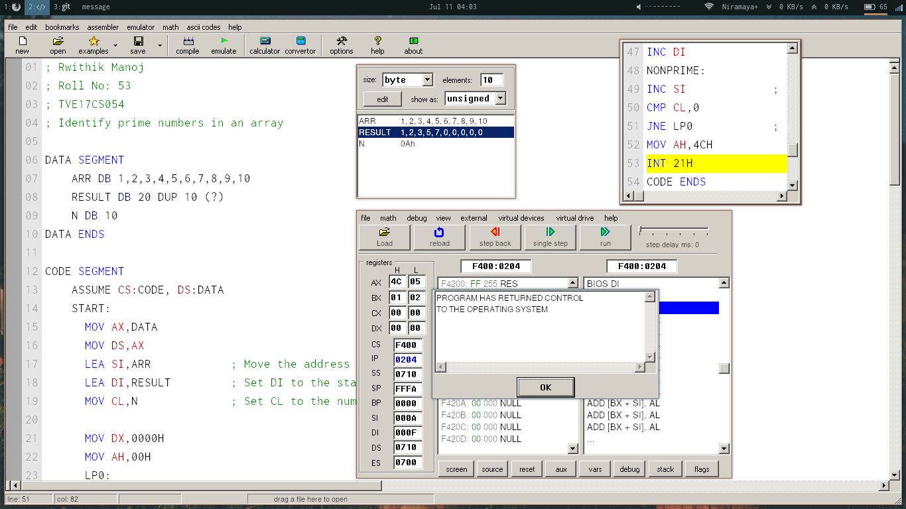

## Problem

 Identify prime numbers from a given array.

Example:
  Input: 1,2,3,4,5,6,7,8,9,10  
output:1,2,3,5,7

## Code


```
; Rwithik Manoj
; Roll No: 53                       
; TVE17CS054
; Identify prime numbers in an array

DATA SEGMENT
    ARR DB 1,2,3,4,5,6,7,8,9,10
    RESULT DB 20 DUP 10 (?)      
    N DB 10
DATA ENDS

CODE SEGMENT
    ASSUME CS:CODE, DS:DATA   
    START:            
      MOV AX,DATA
      MOV DS,AX
      LEA SI,ARR            ; Move the address of the first element of the array to SI
      LEA DI,RESULT         ; Set DI to the starting address of the result
      MOV CL,N              ; Set CL to the number of elements, N
                
      MOV DX,0000H    
      MOV AH,00H      
      LP0:  
      DEC CL                ; Decrement CL
      MOV AL,[SI]           ; Move the next number to be checked to AL
      MOV BL,02H            ; Set BL to 2
      MOV BH,00H            ; Clear BH. BH store the number of divisors greater than 1
      CMP AL,02H            ; If the number is less than 2, goto lebel PRIME
      JLE PRIME
      
      LP1:
        DIV BL              ; Divide AL by BL
        CMP AH,00H          ; Compare the remainder
        JNE NEXT            ; If remainder is not zero, goto lable NEXT
        INC BH              ; Else increment BH
        NEXT:
          CMP BH,01H        ; If BH >= 1, then the number is not prime.
          JE NONPRIME
          INC BL            ; Otherwise, increment BL to the next number
          MOV DX,0000H   
          MOV AH,00H      
          MOV AL,[SI]       ; Reset AL to the original number, AL was overwritten during division
          CMP BL,AL         ; If BL is less than AL, do the inner loop again.
          JNE LP1  
       PRIME:
          MOV [DI],AL       ; If the number is prime, store it in the results array, and increment DI
          INC DI
       NONPRIME:
         INC SI             ; Increment SI either way
         CMP CL,0
         JNE LP0            ; If CL is greater than zero, do the outer loop again
   MOV AH,4CH
   INT 21H
CODE ENDS
END START
```


### Input 1

1, 2, 3, 4, 5, 6, 7, 8, 9, 10


### Output 1

1, 2, 3, 5, 7

### Input 2

12, 24, 35, 43, 55, 67, 88, 99, 44, 37

### Output 2

43, 67, 37

## Screenshots

### Code

\newline
\newline
\newline

### Inputs/Outputs


\newline
\newline


\newline
\newline
